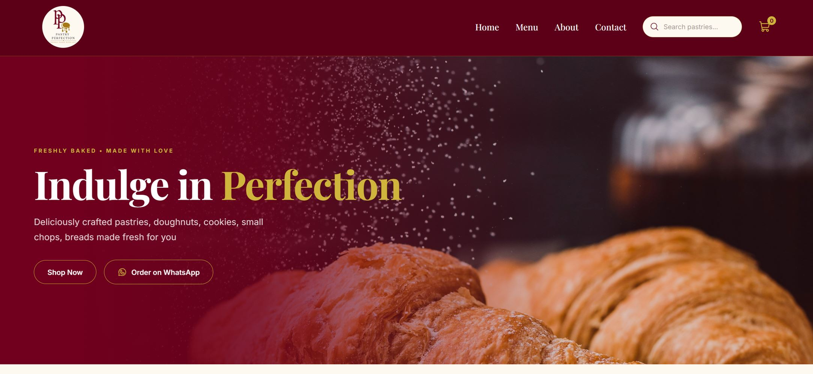
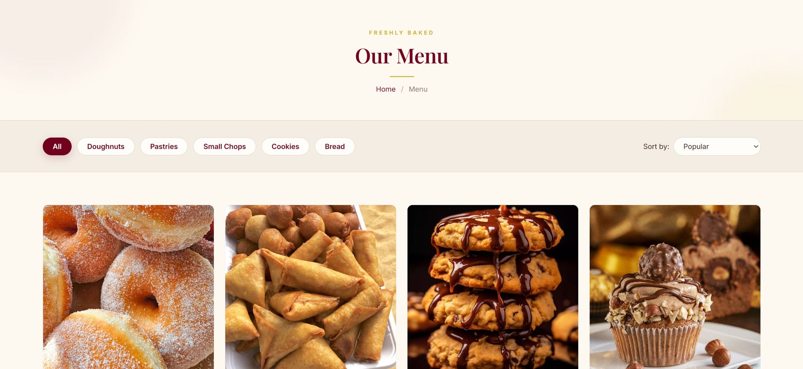
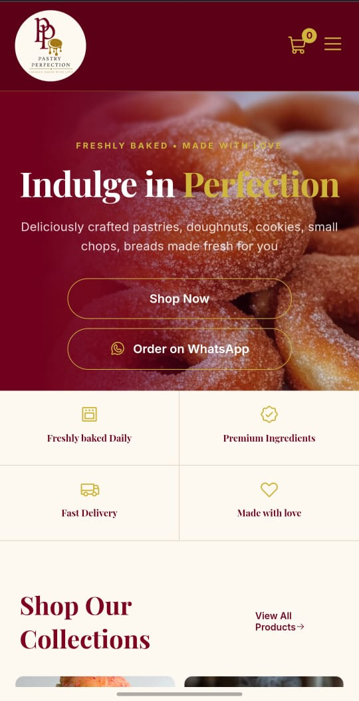

# Pastry Perfection — Bakery Website

A responsive bakery website built from a custom Figma design, focused on practicing real-world layout and styling with HTML, CSS, and JavaScript. What started as a single product page has grown into a full multi-page site with a home page, menu, about, contact, and individual product pages.

**Live Demo:** https://tumiii2.github.io/pastry-perfection/

## About

This project takes a bakery site I designed in Figma and turns it into a fully coded, functioning website. The goal was to move past theory and get comfortable translating a design into clean, structured HTML and CSS — including layout, spacing, typography, responsive components, and interactive features built with JavaScript.

## Pages

- **Home** — hero section, featured product collections, delivery & freshness guarantee, newsletter signup
- **Menu** — full product listing linking out to individual product pages
- **About** — brand story and info
- **Contact** — contact details and form
- **Product Page** — image, price, ratings, description, thumbnail gallery, and reviews for each item

## Features

- Home page hero with call-to-action buttons (Shop Now / Order on WhatsApp)
- Product collection grid linking to individual product pages
- Product detail section with image, price, ratings, and description
- Image thumbnail gallery
- Customer review cards
- Delivery & freshness guarantee section
- Newsletter signup section
- WhatsApp order integration
- Custom footer with navigation, customer service links, and contact info

## Built With

- **HTML5** – semantic page structure across multiple pages
- **CSS3** – Flexbox for layout, custom styling, responsive spacing
- **Figma** – original design
- **JavaScript** – DOM manipulation, event listeners, form validation
- **Google Fonts** – Playfair Display
- **Phosphor Icons** – cart and star icons

## What I Practiced

- Flexbox layout (rows, columns, alignment, spacing)
- Translating a Figma design into pixel-accurate HTML/CSS
- Structuring a multi-page site with shared navigation and footer
- Debugging common CSS issues (margin collapsing, flex-shrink, specificity)
- Structuring semantic HTML with meaningful sections
- Typography and consistent spacing systems across a page
- DOM manipulation and event listeners (click events)
- Showing/hiding elements dynamically with JavaScript
- Timing functions (`setTimeout`) for auto-dismissing UI feedback
- Form validation using regular expressions (email pattern matching)
- CSS hover and active states for interactive feedback
- Anchor-link navigation with smooth scrolling
- Linking related pages together (menu → product page, home → menu, etc.)

## Screenshots

### Home Page

### Product Page

### Mobile View

## Author

Designed and built by Eniola Obasola.
